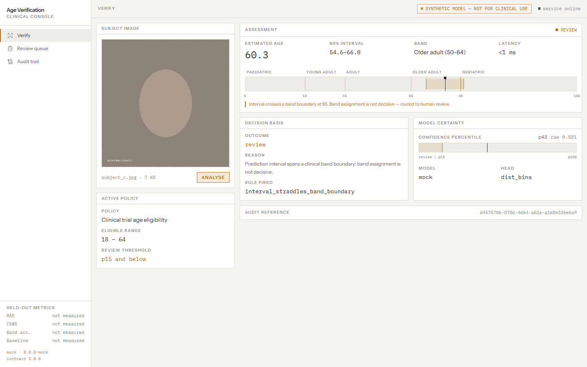
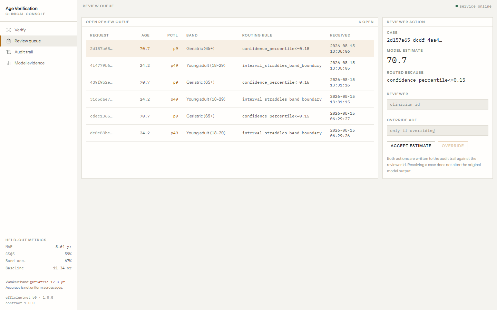
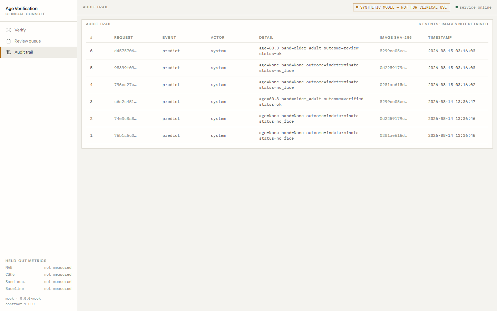

# Age Verification — Clinical Console

Age estimation from facial images, wrapped in the thing that makes it usable in a
clinical workflow: a **confidence-gated decision path** with human review routing and an
audit trail that never stores the image.

Built for the Cognizant NPN hackathon (healthcare domain, "Age Prediction"). The model is
the easy half. The half that matters is what happens when the model is unsure.



---

## The problem with a bare age model

An age regressor outputs a number. A clinical workflow cannot act on a number — it needs
to know whether to trust it. A model that is 4 years off on average is 4 years off in
*both* directions, and near a policy boundary (say, trial eligibility at 18) that error
flips the decision. Reporting MAE and stopping there hides exactly the cases that matter.

So this system does three things a notebook does not:

1. **Bands the estimate into a clinical decision** — eligible, ineligible, or undecided.
2. **Routes uncertain cases to a human** rather than auto-actioning them. Routing fires
   when confidence is in the bottom percentile of the validation distribution **or** when
   the prediction interval straddles a band boundary — because a confident estimate that
   sits on a boundary is still not decisive.
3. **Logs every decision with a digest, never the image.** Verifiable, not asserted.

## Screens

| | |
|---|---|
|  |  |
| **Review queue** — cases the model declined to decide alone, with the rule that routed each one. | **Audit trail** — every prediction and adjudication, image SHA-256 only. |

The band ladder on the assessment screen is the piece worth looking at: it draws the
prediction interval on the clinical band scale and lights the crossed boundary in amber,
so it shows *why* a case went to review instead of announcing that it did.

---

## Run it

Two commands. One process serves the API and the built frontend on one port — no CORS,
no second server, nothing to go wrong in front of a panel.

```bash
python -m venv .venv
.venv/Scripts/python.exe -m pip install -r requirements.txt   # Linux/macOS: .venv/bin/python

cd web && npm install && npm run build && cd ..
.venv/Scripts/python.exe -m uvicorn server.main:app --port 8000
```

Open <http://127.0.0.1:8000>. Runs with `NPN_MOCK=1` by default — a synthetic model that
returns contract-shaped responses, deterministic in the image digest. The UI shows a
`SYNTHETIC MODEL` badge whenever mock mode is on, so nobody demos fake numbers by accident.

**Frontend dev loop:** `cd web && npm run dev` (proxies `/api` to port 8000).

### Checks

```bash
.venv/Scripts/python.exe server/bands.py      # decision + routing logic
.venv/Scripts/python.exe server/store.py      # audit/queue, incl. no-image-retention
.venv/Scripts/python.exe ml/gate0.py --selfcheck
.venv/Scripts/python.exe tests/test_api.py    # 7 contract tests
cd web && node scripts/shots.mjs              # capture the three screens
```

---

## Layout

```
contract/predict.contract.md   frozen API contract, v1.0.0 — the source of truth
server/bands.py                age bands, clinical policy, review routing
server/store.py                sqlite audit log + review queue (digest only)
server/main.py                 FastAPI: API + serves web/dist on one port
ml/gate0.py                    measures the dataset's real age distribution
web/src/BandLadder.tsx         interval-on-band-scale visualisation
web/src/api.ts                 typed client — mirrors the contract exactly
tests/test_api.py              contract tests asserted against the contract doc
```

The API contract was frozen before either lane started, so the frontend was built
against mocks while the model trained behind it. `web/src/api.ts` and
`contract/predict.contract.md` must change in the same commit or the freeze meant nothing.

### Response envelope

Every outcome returns the same shape — including the failures. `no_face`, `multi_face`,
`low_quality` and `error` are first-class states with defined UI, not exceptions:

```json
{
  "status": "ok",
  "age_estimate": 34.2,
  "age_interval": [29.1, 39.3],
  "confidence_percentile": 0.42,
  "band": { "id": "adult", "label": "Adult (30-49)", "min": 30, "max": 49 },
  "decision": { "outcome": "verified", "rule": "within_policy_range", "reason": "…" },
  "review_required": false
}
```

---

## Honest limits

Stated here rather than discovered by a reviewer:

- **The headline MAE is optimistic, and we measured by how much.** The reference dataset is
  celebrity photography and the publisher's train/test split is per-image, not per-person,
  so the same individual appears on both sides. Inspecting the highest-similarity
  cross-split pairs at age 72 confirmed it visually: three of the top six pairs are the
  same person in train and in test. Excluding test images that closely resemble training
  images moves MAE from **5.64 to 6.00 at a 0.93 cosine cut, and 6.57 at 0.90**. The
  similarity is computed with our own age-trained backbone, which cannot cleanly separate
  "same person" from "similar-looking face of the same age", so 6.57 is a pessimistic
  bound rather than a corrected figure. **The honest reading is that the true value lies
  between 5.64 and 6.57.** The dataset ships anonymised filenames with no identity labels,
  so a correct per-person split cannot be reconstructed; the effect can be quantified but
  not removed. Resolving it properly needs an identity-tuned face-recognition embedding.
- **Image only.** The problem statement also lists text, voice and other biometrics. No
  corpus was available for those, so a second modality was scoped out rather than faked.
- **No demographic fairness numbers.** The reference dataset carries no skin-tone or
  ethnicity labels, so a per-group fairness breakdown cannot be computed from it. This is
  a real gap in a biometric healthcare system, and closing it needs an external balanced
  evaluation set (e.g. FairFace). Residuals are sliced by age band instead, which the
  labels do support.
- **Dataset age range is measured, not assumed.** The Kaggle page states 1–100 while a
  public reimplementation used a 20–50 subset. Both are true: the dataset ships two
  independent trees. Gate 0 read the authoritative per-age file counts and recorded them
  in `ml/dataset_census.json` — 185,632 training images spanning ages 1–100, with
  under-18 at 8,119 (4.4%) and over-64 at 9,178 (4.9%). Both clear the 2% floor, so
  lifespan banding is supportable. **The 90+ tail is only 273 images**, which is why MAE
  is reported per band rather than as a single headline number.
- **Confidence is validated, not asserted.** MAE is reported per confidence decile so the
  routing rule can be checked: if low-confidence predictions are not actually the wrong
  ones, the review queue is theatre. The threshold is a percentile so the rule holds
  regardless of how the calibration curve comes out.
- **Not for clinical use.** Research demo. Age estimation from faces carries real bias and
  consent problems and is not a substitute for documented date of birth.

## Data handling

Images are hashed and discarded within the request. `server/store.py` accepts a digest
string; there is no code path that writes image bytes to disk. `tests/test_api.py`
asserts the raw bytes are absent from the database file after a prediction.
