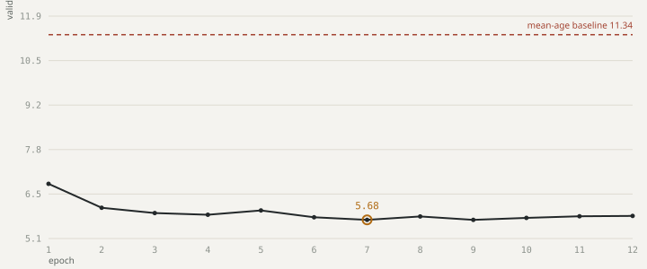

# Training run `dist-v1`

## Validation MAE by epoch

| epoch | val MAE (yr) | vs baseline | elapsed (min) |
|---:|---:|---:|---:|
| 1 | 6.785 | −40% | — |
| 2 | 6.054 | −47% | — |
| 3 | 5.895 | −48% | — |
| 4 | 5.842 | −48% | — |
| 5 | 5.973 | −47% | — |
| 6 | 5.765 | −49% | — |
| 7 **best** | 5.685 | −50% | — |
| 8 | 5.790 | −49% | — |
| 9 | 5.685 | −50% | — |
| 10 | 5.746 | −49% | — |
| 11 | 5.796 | −49% | — |
| 12 | 5.805 | −49% | — |

## Held-out test split

- **MAE** 5.639 yr (baseline 11.336)
- **CS@5** 59.3% within 5 years
- **Band accuracy** 66.8%
- n = 47,568

### Per-band MAE

| band | n | MAE (yr) |
|---|---:|---:|
| paediatric | 2,937 | 6.20 |
| young_adult | 13,121 | 4.98 |
| adult | 23,301 | 4.80 |
| older_adult | 5,933 | 7.60 |
| geriatric | 2,276 | 12.25 |
| geriatric_90plus | 77 | 15.95 |

### Review-queue verdict (PASS)

Bottom/top confidence-decile MAE ratio **3.888×** (threshold 1.3×), monotonic **1.0** (threshold 0.7).

> Low-confidence predictions are measurably worse, so confidence-based routing is doing real work.
